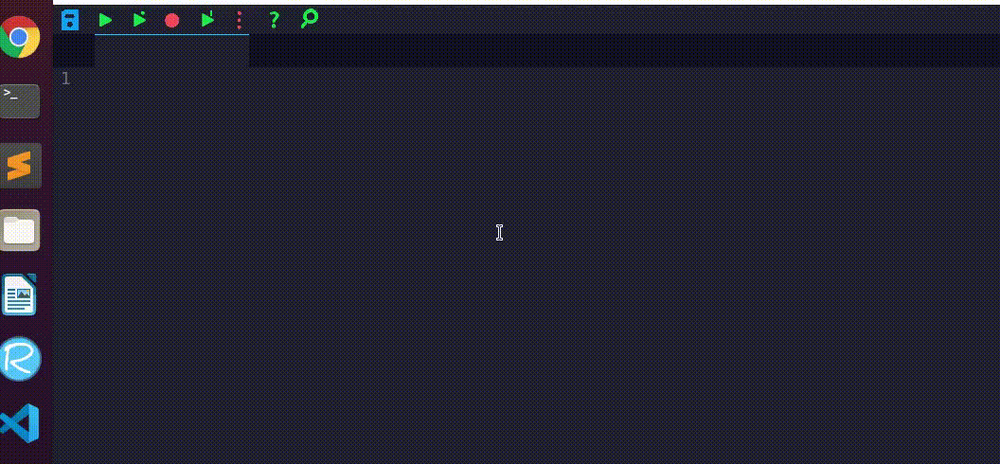
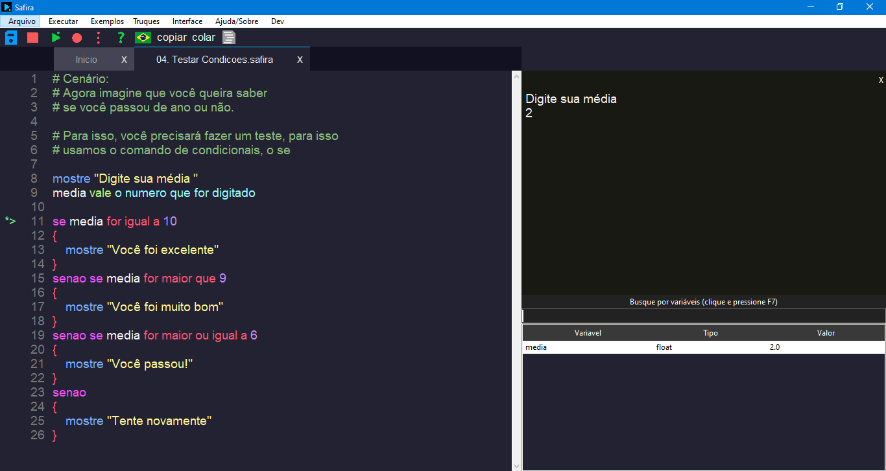

# Introdução



-------


A Safira é uma linguagem de programação focada na lógica com o objetivo de amortecer o impacto do primeiro contato com o mundo da programação, oferecendo uma interface simples, intuitiva e uma codificação natural.

Aviso: Uma versão dos outros repositórios estão embutidos neste repositório.

A Safira é focada apenas na estrutura básica e em pequenos scripts, sendo que o principal diferencial dela é aceitar comandos em níveis naturais, como se fosse uma pessoa conversando com outra e comandos em linguagem similar as principais linguagens do mercado.

Nos primeiro contato com a Safira, é recomendado o uso de comandos no idioma nativo, como o português, exemplo:

Se o foco for ensinar linguagem Python para um grupo de pessoas com dificuldade, é recomendado começar com comandos bem simples, como:

    nome vale o que o usuario digitar

    se nome for igual a "Gabriel" entao {
        mostre "Olá Gabriel"
    } 

Posteriormente, é recomendado a variação, mesmo que seja comando por comando, no ritmo do aluno para a seguinte codificação:

    nome = input

    if nome == "Gabriel" {
        print "Olá Gabriel"
    }

Perceba que a Safira está muito mais próximo do Python agora.

Desta forma, a complexidade das linguagens de programação, é reduzida e o conceito é levado mais em conta. 

A safira entende comando em inglês, português, espanhol e de forma similar a outras linguagens do mercado.
 
É assim que fica a codificação de um programa maior na Safira.


# Como executar os arquivos do repositório
## 1° forma, versão estável para aprender
Baixe a versão executável, no final da página em **Download**.

1. Baixe o arquivo .zip
2. Extraia-o em alguma pasta
3. Execute a Safira

**Para distribuições Linux, certifique de fornecer as permissões para executar.**

## 2° forma, versão de desenvolvimento
Está é uma versão de desenvolvimento, com bugs e implementações em andamento.

1. clone este repositório  
2. Baixe e instale o Python3.8 (3.7 e 3.6 são aceitos)  
3. Instale os pacotes necessários com o comando abaixo  

  ```shell
    python3.8 -m pip install -r requeriments.txt
  ```
4. Execute o arquivo safiraide.py

A IDE será carregada, e você já pode desenvolver

-------------------------------------

# Como programar em Safira?
Confira os principais comandos aqui: https://safiralang.blogspot.com/p/comandos.html

-------------------------------------

# Como fazer parte do desenvolvimento da safira?
Entre em contato com:
* combratectecnologias@gmail.com

# Quem pode ajudar no desenvolvimento?
Atualmente precisamos de pessoas que possam dar feedback sobre o projeto, que possam usá-la, de desenvolvedores que possam melhorar o código, tornando o mais escalável, de designs para ajudar no desenvolvimento de interfaces mais bonitas e que sejam úteis para os usuários e de pessoas que possam contribuir de outras formas.

# Quais tecnologias o projeto usa atualmente?
* Python3.8 para todo o projeto por enquanto

#### Interface gráfica
* tkinter como principal biblioteca para a geração das interfaces

#### Interpretador
* expressões regulares para a análise de comandos no interpretador

#### Recursos
* biblioteca requests para a comunicação com a internet

-------------------------

# Download
* [Windows 10](https://safiralang.blogspot.com/p/downloads.html)
* [Linux Mint](https://safiralang.blogspot.com/p/downloads.html)
* [Ubuntu](https://safiralang.blogspot.com/p/downloads.html)

# Outros Links
* [Blog](https://safiralang.blogspot.com/)
* [Facebook](https://www.facebook.com/safiralang/)
